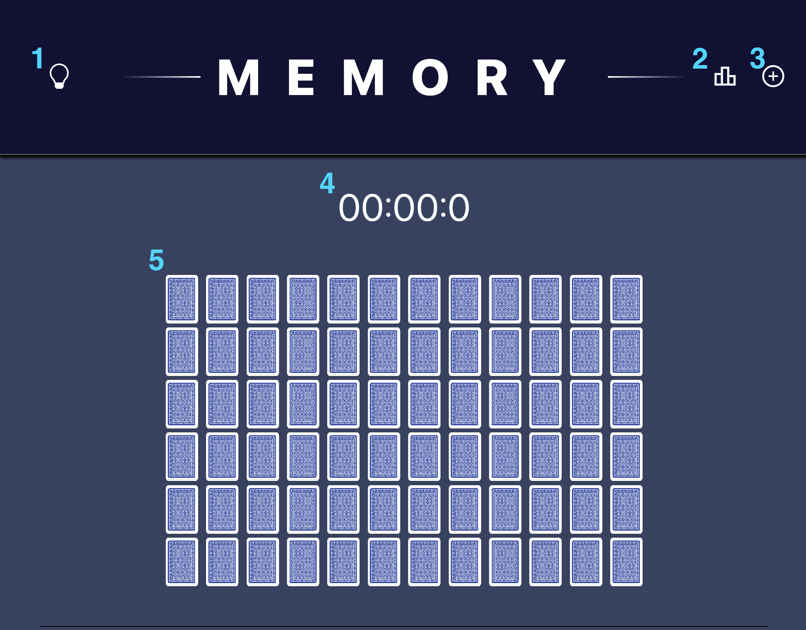

<h1 style="border-bottom: 1px solid black; font-weight: 300">Memory</h1>

1. Dark / Light mode selecter

2. High scores

3. New Game / Change Difficulty

4. Timer

5. Playing cards

#### How to play

Select a card to turn it over. Then select another card. If they are cards of the same number they will remain face up otherwise they will be turned back over. The game ends when all cards are face up. And your score is the time it took you to complete.

Enjoy
